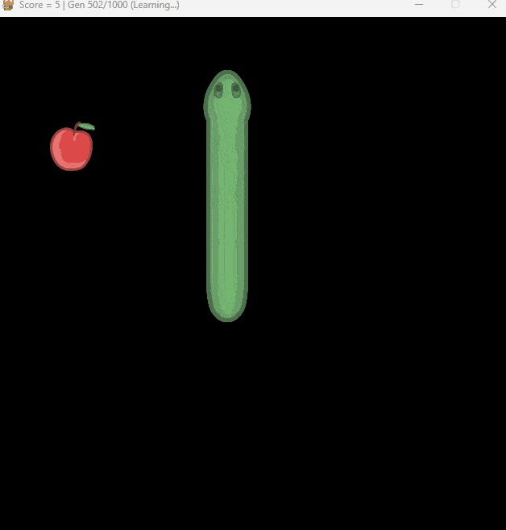

# Machine Learning
Machine Learning Project – Snake Game AI using Genetic Algorithms and Neural Networks

<div align="center">
  
</div>

> This project focuses on developing an AI to play the classic Snake game using genetic algorithms and neural networks. The AI learns to play the game by evolving over generations, improving its performance based on fitness scores.
> This project was developed as part of an academic module on Machine Learning, that's why the documentation and comments are in French.
> So I've started from the [codebase](./copyrights/3-RL/) that the teacher provided and made some improvements and modifications... 

---

## Getting Started

To run the project locally, follow these steps:
1. Clone the repository:
   ```bash
   git clone https://github.com/alexyvanot/Snake-Game-AI.git
    cd Snake-Game-AI
   ```

2. Create and activate a virtual environment (optional but recommended):
   ```bash
   python -m venv .venv
   source venv/bin/activate  # On Windows use `venv\Scripts\activate`
   ```

3. Install the required dependencies:
   ```bash
   pip install -r requirements.txt
   ```

4. Run the main script to start the Snake Game AI:
   ```bash
    python main.py
   ```

> You can modify parameters in `.env` to customize the AI's training process.

---

## Model Results
<details>
<summary>Modèle Vertical Iteration 573/1000 - Best score = 0.9600</summary>
  
  
</details>
<details>
<summary>Modèle Horizontal Iteration 1000/1000 - Best score = 0.9800</summary>
  
  
</details>

---

## Tech Stack

- [Python 3.13.*](https://www.python.org/)
- [numpy](https://numpy.org/)
- [Pygame](https://www.pygame.org/)

---

## Author

Project developed by **Alexy VANOT**  
As part of the *Machine Learning* academic module

---
